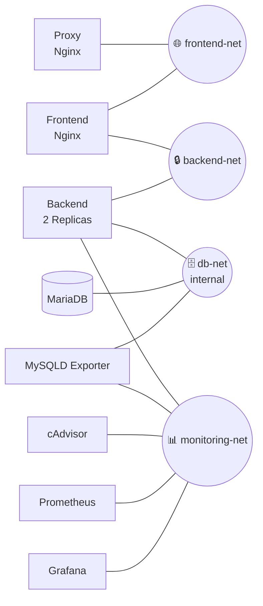

# Architecture Diagrams

## 1. Full Stack Architecture

Application flow, monitoring flow, host bind mounts, persistent volumes, and Docker secrets across the Docker host.

```mermaid
flowchart LR
    %% =========================
    %% External
    %% =========================
    User([🌐 Internet])

    %% =========================
    %% Docker Host
    %% =========================
    subgraph Host["🖥️ Host Machine"]

        %% Host Resources
        RootFS[/📁 Host: /root]
        DockerFS[/📁 /var/lib/docker/]

        %% Docker Engine
        subgraph Docker["🐳 Docker Engine"]

            %% Application Stack
            Proxy[Proxy<br/>Nginx]
            Frontend[Frontend<br/>Nginx]
            Backend([Backend<br/>2 Replicas])
            DB[(MariaDB)]

            %% Monitoring Stack
            Exporter{{⚙️<br/>MySQLD Exporter}}
            CAdvisor{{⚙️<br/>cAdvisor}}
            Prometheus[Prometheus]
            Grafana[Grafana]

            %% Persistent Volumes
            DBData[/💾 db-data/]
            PromData[/💾 prometheus-data/]
            GrafData[/💾 grafana-data/]

            %% Docker Secret
            Secret[/🔒 db-password.txt/]

            %% Docker Networks
            subgraph frontend_net["🔵 frontend-net"]
                Proxy
                Frontend
            end

            subgraph backend_net["🟢 backend-net"]
                Frontend
                Backend
            end

            subgraph db_net["🟠 db-net (internal)"]
                Backend
                DB
                Exporter
            end

            subgraph monitoring_net["🟣 monitoring-net"]
                Backend
                Exporter
                CAdvisor
                Prometheus
                Grafana
            end
        end
    end

    %% =========================
    %% Application Flow
    %% =========================
    User --> Proxy
    Proxy --> Frontend
    Frontend --> Backend
    Backend --> DB

    %% =========================
    %% Monitoring Flow
    %% =========================
    DB -. Metrics .-> Exporter
    Exporter -. Scrape .-> Prometheus
    Backend -. Metrics .-> Prometheus
    CAdvisor -. Container Metrics .-> Prometheus
    Prometheus --> Grafana

    %% =========================
    %% Host Bind Mounts
    %% =========================
    RootFS -. RO Bind Mount .-> CAdvisor
    DockerFS -. RO Bind Mount .-> CAdvisor

    %% =========================
    %% Persistent Volumes
    %% =========================
    DBData --> DB
    PromData --> Prometheus
    GrafData --> Grafana

    %% =========================
    %% Docker Secrets
    %% =========================
    Secret -.-> DB
    Secret -.-> Backend
    Secret -.-> Exporter

    %% =========================
    %% Legend
    %% ========================

    %% =========================
    %% Link Colors
    %% =========================

    %% Application Flow (Blue)
    linkStyle 0 stroke:#1E88E5,stroke-width:2px
    linkStyle 1 stroke:#1E88E5,stroke-width:2px
    linkStyle 2 stroke:#1E88E5,stroke-width:2px
    linkStyle 3 stroke:#1E88E5,stroke-width:2px

    %% Monitoring (Green)
    linkStyle 4 stroke:#2E7D32,stroke-width:2px,color:#2E7D32
    linkStyle 5 stroke:#2E7D32,stroke-width:2px,color:#2E7D32
    linkStyle 6 stroke:#2E7D32,stroke-width:2px,color:#2E7D32
    linkStyle 7 stroke:#2E7D32,stroke-width:2px,color:#2E7D32
    linkStyle 8 stroke:#2E7D32,stroke-width:2px,color:#2E7D32

    %% Host Mounts (Purple)
    linkStyle 9 stroke:#8E24AA,stroke-width:2px
    linkStyle 10 stroke:#8E24AA,stroke-width:2px

    %% Volumes (Orange)
    linkStyle 11 stroke:#FB8C00,stroke-width:2px
    linkStyle 12 stroke:#FB8C00,stroke-width:2px
    linkStyle 13 stroke:#FB8C00,stroke-width:2px

    %% Secrets (Red)
    linkStyle 14 stroke:#D32F2F,stroke-width:2px
    linkStyle 15 stroke:#D32F2F,stroke-width:2px
    linkStyle 16 stroke:#D32F2F,stroke-width:2px
```


## 2. Network Topology

Which services belong to each Docker network (`frontend-net`, `backend-net`, `db-net`, `monitoring-net`).


